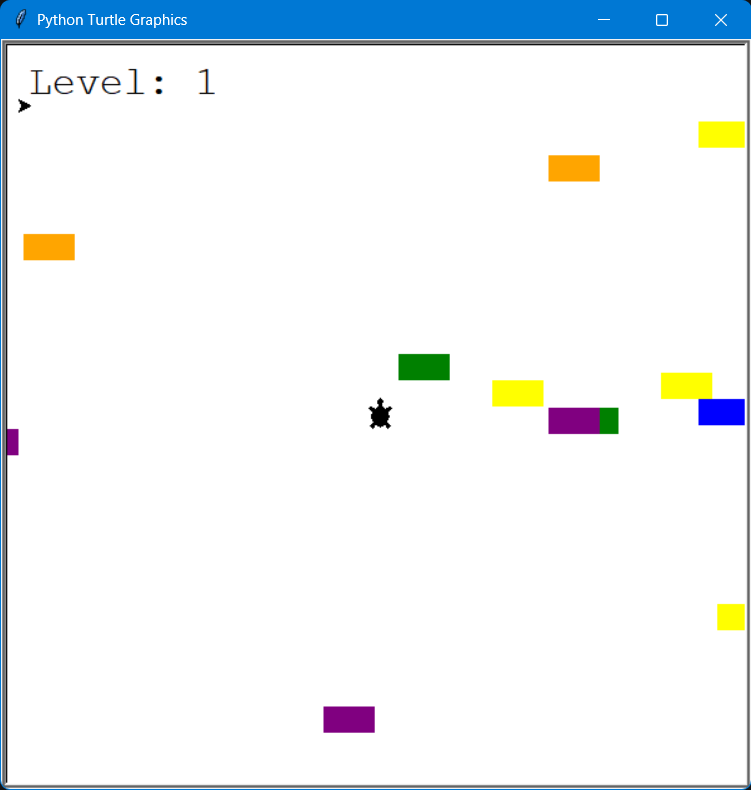
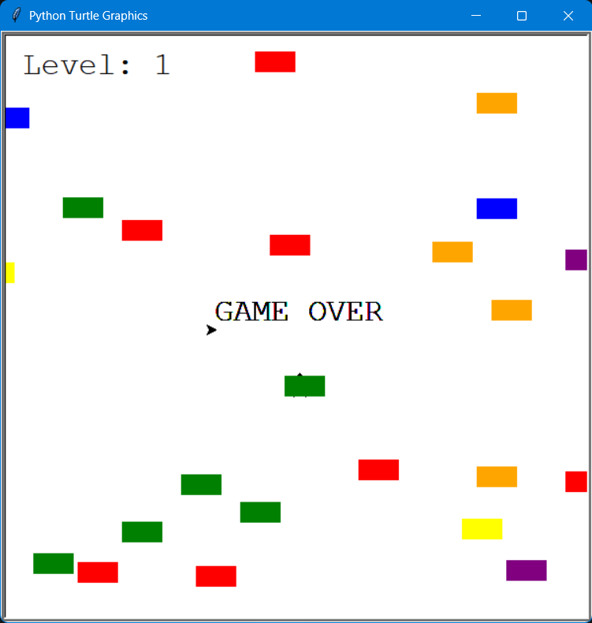

# 🐢 Turtle Crossing Game

A simple arcade-style game built with Python using the Turtle module.

The goal is to help the turtle cross the road while avoiding moving cars.
Each successful crossing increases the difficulty!

---

## 🎮 Gameplay

* Control the turtle using the **Up arrow key**
* Avoid incoming cars 🚗
* Reach the top to level up
* The game gets faster each level
* Game ends on collision

---

## 🧠 Features

* Object-Oriented Programming (OOP)
* Dynamic difficulty (speed increases)
* Collision detection
* Clean project structure (multiple modules)
* Random car spawning

---

## 📁 Project Structure

```
.
├── main.py
├── player.py
├── car_manager.py
├── scoreboard.py
└── images/
    ├── game.png
    └── game_over.png
```

---

## 🖼️ Screenshots

### Gameplay



### Game Over



---

## 🚀 How to Run

1. Make sure you have Python installed (3.x)

2. Clone the repository:

```bash
git clone https://github.com/your-username/turtle-crossing-game.git
```

3. Navigate to the project folder:

```bash
cd turtle-crossing-game
```

4. Run the game:

```bash
python main.py
```

---

## 🛠️ Technologies Used

* Python 🐍
* Turtle Graphics

---

## 📈 Future Improvements

* Add restart button
* Add sound effects
* Add multiple lives ❤️
* Different types of cars 🚙
* Main menu

---

## 💡 What I Learned

* Working with classes and OOP
* Structuring a multi-file Python project
* Game loop logic
* Handling collisions and game states

---

## 👩‍💻 Author

Created as part of the **100 Days of Code: Python Bootcamp**, with custom improvements and refactoring.
